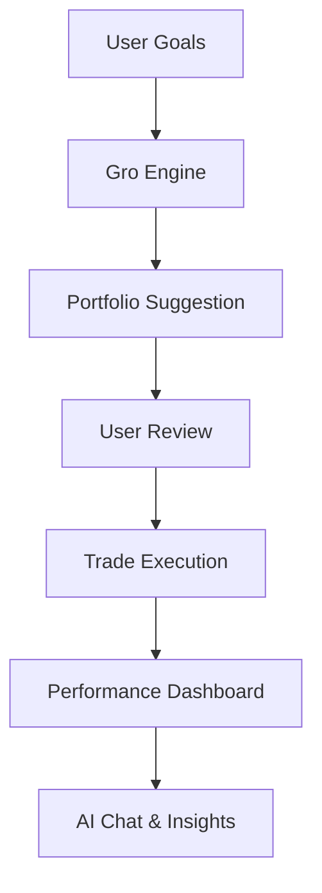

<div align="center">

# 🌱 Gro — Goals, Returns, Outcomes

---


---

## 📈 Ticker: $GRO

<table align="center">
  <tr><td>Sector</td><td>FinTech</td></tr>
  <tr><td>Exchange</td><td>App Store, Play Store</td></tr>
  <tr><td>Market Cap</td><td>🚀 Early Stage</td></tr>
  <tr><td>Dividend</td><td>Knowledge & Growth</td></tr>
  <tr><td>Analyst Rating</td><td>⭐️⭐️⭐️⭐️⭐️</td></tr>
</table>

---

## 📰 News Flash

<i>Gro launches the first goal-driven investing app that feels like a personal stock!</i>

---

## 🧩 The Problem

Most people don’t have time to cherry-pick stocks or learn financial models.  
The fallback? “Just put it all in the S&P 500.”  
But that’s not personal. It ignores your goals, timeline, and risk comfort.

---

## 💡 The Idea

Gro is your investment assistant that:<br>
• Lets you enter your goals (retirement, house, growth, etc.)<br>
• Runs financial models & simulations (Monte Carlo, Sharpe, CAPM, Graham, Black-Scholes)<br>
• Uses AI to explain results in plain English<br>
• Builds a personalized portfolio (stocks, ETFs, bonds) for you<br>
• You review & confirm before any trades — Gro suggests, you decide

---

## 🏗️ Architecture

<table align="center">
  <tr>
    <td><b>Layer</b></td>
    <td><b>Tech Stack</b></td>
    <td><b>Role</b></td>
  </tr>
  <tr>
    <td>Frontend</td>
    <td>Flutter (Dart)</td>
    <td>iOS & Android app, onboarding, dashboard</td>
  </tr>
  <tr>
    <td>Backend</td>
    <td>Node.js (Express)</td>
    <td>Auth, subscriptions, orchestration</td>
  </tr>
  <tr>
    <td>Engine</td>
    <td>Python (FastAPI)</td>
    <td>Quant finance logic, simulations</td>
  </tr>
  <tr>
    <td>Data</td>
    <td>Yahoo Finance, Alpaca, OpenAI</td>
    <td>Market data, trades, AI chat</td>
  </tr>
</table>

---

## 🔄 User Flow

<ol align="center">
  <li>Download Gro (iOS/Android)</li>
  <li>Sign up & choose a plan (free trial, monthly, lifetime)</li>
  <li>Input your goals (timeline, risk, contributions)</li>
  <li>Gro runs the numbers (Python engine)</li>
  <li>See your suggested portfolio & risk analysis</li>
  <li>Confirm & invest (Alpaca brokerage)</li>
  <li>Track performance, chat with AI, manage settings</li>
</ol>

---

## 🧠 Features

<ul align="center">
  <li><b>AI Chat:</b> Ask anything about US stocks, your portfolio, or market news</li>
  <li><b>Personalized Dashboard:</b> See your growth, risk, and progress</li>
  <li><b>Emergency Sell:</b> One-tap sell of your entire portfolio</li>
  <li><b>Notifications:</b> Stay updated on performance & market moves</li>
  <li><b>Account Management:</b> Change email, password, payment plan, delete account</li>
</ul>

---

## 🚀 Vision

<i>
Now: MVP powered by Alpaca & Yahoo Finance, subscription revenue<br>
Next: More asset classes, multi-broker support<br>
Future: Gro becomes your personal investment companion — goal-first, transparent, and educational
</i>

---

## 💬 Analyst Commentary

<i>
Gro isn’t about beating the market.<br>
It’s about making sure your investments fit <b>you</b> — your goals, your time horizon, your comfort with risk — while Gro handles the math and complexity behind the scenes.
</i>

---

## 📊 Stock Chart

<div align="center">



</div>

---

## 🏁 Get Started

<div align="center">

```bash
# Flutter frontend
cd client
flutter run

# Node.js backend
cd server
npm install
npm start

# Python engine
cd engine
uvicorn app:app --reload
```

</div>

---


</div>
