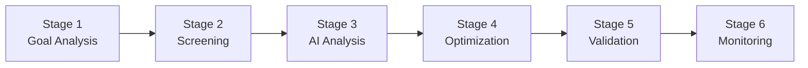

# 🚀 **Gro Portfolio Creation Engine**
### *System Flow Breakdown*

---

## 🎯 **Stage 1: Goal Analysis & Requirements Engine**

### 📥 **What Goes In:**
| Input | Description |
|-------|-------------|
| 🎯 **Primary Goal** | retirement, house, growth, income |
| ⏰ **Time Horizon** | months |
| 💰 **Target Amount** | $ |
| 📈 **Monthly Contribution** | capability |
| ⚖️ **Risk Tolerance** | 1-10 scale |
| 💼 **Financial Situation** | current state |

### ⚙️ **Processing:**

> **Monte Carlo Analysis**
> - `Monte Carlo endpoint` calculates required annual return to hit goal
> 
> **Risk Assessment** 
> - `Risk assessment endpoints` determine acceptable volatility levels
> 
> **Performance Validation**
> - `Returns analysis` establishes minimum performance thresholds
> - `Stress testing` validates goal feasibility under different market conditions

### 📤 **What Comes Out:**
- ✅ Required annual return percentage
- ✅ Maximum acceptable volatility  
- ✅ Maximum drawdown tolerance
- ✅ Minimum Sharpe ratio target
- ✅ Portfolio constraints framework

**🔄 Feeds Into:** Stage 2 screening criteria

---

## 🔍 **Stage 2: Universe Screening Engine**

### 📥 **What Goes In:**
- Goal requirements from **Stage 1**
- Universe of **10,000+ stocks**
- Current market conditions

### 🔄 **Processing Layer 1 - Fundamental Screening:**

| Filter | Process | Outcome |
|--------|---------|---------|
| 💰 **Financial Ratios** | eliminate stocks with poor P/E, debt levels | Quality baseline |
| 📊 **Profitability** | filter for minimum ROE, ROA, margins | Profitable companies |
| 🏆 **Quality Indicators** | Piotroski, Altman remove financially weak companies | Strong balance sheets |
| 📈 **Growth** | ensure minimum revenue/earnings growth | Growing businesses |
| 💎 **Graham Analysis** | identify value opportunities | Undervalued gems |

### 🔄 **Processing Layer 2 - Technical Screening:**

| Analysis | Function | Result |
|----------|----------|--------|
| 〰️ **Moving Averages** | confirm upward trends | Momentum confirmation |
| 📊 **Oscillators** | avoid overbought/oversold stocks | Optimal entry timing |
| 📈 **Volume Analysis** | ensure adequate liquidity | Tradeable positions |
| ⚡ **Relative Strength** | keep outperforming stocks | Market leaders |
| 📉 **Trend Analysis** | confirm momentum direction | Directional clarity |

### 🔄 **Processing Layer 3 - Risk Screening:**

| Risk Type | Measurement | Limit |
|-----------|-------------|-------|
| β **Beta** | match user's risk tolerance | Systematic risk control |
| 🌊 **Volatility** | stay within goal parameters | Price stability |
| 📉 **Drawdown** | eliminate excessive downside risk | Downside protection |
| 💧 **Liquidity** | ensure tradeable positions | Market access |
| 🦋 **Tail Risk** | remove extreme outliers | Black swan protection |

### 📤 **What Comes Out:**
- ✅ **~100-200 stocks** that meet all criteria
- ✅ Each stock **pre-scored** on multiple dimensions

**🔄 Feeds Into:** Stage 3 deep analysis

---

## 🤖 **Stage 3: AI-Enhanced Deep Analysis Engine**

### 📥 **What Goes In:**
- Screened stock candidates from **Stage 2**
- Real-time market data
- Historical performance data

### 🧠 **Processing - Multi-Dimensional Analysis:**

#### 💪 **Fundamental Strength Analysis:**
- **Ratios endpoints** → valuation scores
- **Cashflow analysis** → financial health measures  
- **Efficiency metrics** → management quality evaluation
- **Peer comparison** → relative positioning
- **Sector analysis** → industry leader identification

#### 📈 **Technical Momentum Analysis:**
- **Support/resistance** → entry point identification
- **Bollinger bands** → price positioning measurement
- **Volume patterns** → institutional interest confirmation
- **Volatility measures** → price stability assessment

#### 💭 **Sentiment & Alternative Data:**
- **News sentiment** → market perception gauge
- **Social sentiment** → retail interest capture
- **Analyst sentiment** → professional opinion tracking
- **Insider trading** → corporate confidence revelation

#### 🎯 **ML Predictive Analysis:**
- **Earnings prediction** → surprise forecasting
- **Momentum forecasting** → short-term move prediction
- **Volatility prediction** → future risk estimation
- **Market regime** → current condition adaptation

### 📤 **What Comes Out:**
- ✅ **Composite score** for each stock (0-100)
- ✅ **Risk/return profile** for each candidate
- ✅ **Confidence intervals** on predictions
- ✅ **Sector and style** classifications

**🔄 Feeds Into:** Stage 4 portfolio construction

---

## ⚖️ **Stage 4: Portfolio Optimization Engine**

### 📥 **What Goes In:**
- Top-scored stocks from **Stage 3**
- Goal requirements from **Stage 1**
- User risk preferences
- Current market correlations

### 🔄 **Processing - Multi-Method Optimization:**

#### 🌍 **Diversification Analysis:**
| Analysis Type | Function | Goal |
|---------------|----------|------|
| 🏭 **Sector Analysis** | ensure no concentration risk | Balanced exposure |
| 🌎 **Geographic Risk** | balance regional exposure | Global diversification |
| 🔗 **Correlation Analysis** | build correlation matrix | Independence verification |
| 📊 **Factor Exposure** | balance growth/value/momentum | Style diversification |

#### ⚖️ **Weight Optimization Methods:**
- **Mean-variance optimization** → maximize Sharpe ratio
- **Risk parity** → equalize risk contribution across holdings
- **Kelly Criterion** → optimize position sizes for growth
- **Black-Litterman** → incorporate ML predictions as views

#### 🚧 **Constraint Application:**
- ✅ Maximum single position (typically **8%**)
- ✅ Minimum number of holdings (**15-25 stocks**)
- ✅ Sector concentration limits (max **25% per sector**)
- ✅ Liquidity requirements (minimum daily volume)

#### 🎼 **Ensemble Approach:**
- Combines multiple optimization methods
- Weights methods based on user risk tolerance
- Applies goal-specific adjustments

### 📤 **What Comes Out:**
- ✅ **Optimal portfolio weights** for each stock
- ✅ **Expected portfolio return** and volatility
- ✅ **Risk decomposition** by position
- ✅ **Rebalancing thresholds**

**🔄 Feeds Into:** Stage 5 validation

---

## 🎲 **Stage 5: Monte Carlo Validation Engine**

### 📥 **What Goes In:**
- Proposed portfolio from **Stage 4**
- Historical return/volatility data
- User's contribution schedule
- Goal timeline and targets

### 🔄 **Processing - Scenario Simulation:**

#### 📊 **Historical Simulation:**
- **Returns analysis** → uses actual historical data
- **Monte Carlo portfolio** → runs **10,000+ scenarios**
- **Stress testing** → applies crisis scenarios (2008, COVID, etc.)
- **Market regime** → tests across bull/bear/sideways markets

#### 🎯 **Goal Achievement Testing:**
- Probability of reaching target amount
- Distribution of potential outcomes
- Time-to-goal analysis
- Contribution sensitivity analysis

#### ⚠️ **Risk Validation:**
- Maximum expected drawdown
- Value at Risk calculations
- Tail risk scenarios
- Recovery time analysis

#### 📈 **Performance Validation:**
- Expected vs required returns
- Volatility vs user tolerance
- Sharpe ratio achievement
- Benchmark comparison

### 📤 **What Comes Out:**
- ✅ **Goal achievement probability** (target: **>70%**)
- ✅ **Expected portfolio outcomes** distribution
- ✅ **Risk metrics** validation
- ✅ **Stress test** results
- ✅ **Refinement recommendations** if needed

**🔄 Feeds Into:** Stage 6 if approved, back to Stage 4 if refinement needed

---

## 🔄 **Stage 6: Continuous Monitoring & Optimization Engine**

### 📥 **What Goes In:**
- Live portfolio performance data
- Real-time market conditions
- Updated user goals/circumstances
- New market data and predictions

### 📊 **Daily Health Monitoring:**

#### 📈 **Performance Tracking:**
- **Portfolio analysis** → measures vs benchmarks
- **Risk metrics** → monitor current vs target risk
- **Drawdown tracking** → watches for excessive losses
- **Goal progress** → updates probability calculations

#### 🌊 **Market Condition Monitoring:**
- **Market regime detection** → identifies shifts
- **Sector rotation** → spots new opportunities
- **Volatility prediction** → anticipates risk changes
- **Correlation tracking** → monitors diversification

#### ⚖️ **Rebalancing Triggers:**
- Weight drift beyond thresholds
- Risk characteristics changed
- New opportunities identified
- Goal timeline adjustments

#### 🧠 **AI Insights Generation:**
- **Sentiment analysis** → explains market moves
- **ML predictions** → forecast portfolio needs
- **Risk alerts** → warn of potential issues
- **Opportunity identification** → suggests improvements

### 📤 **What Comes Out:**
- ✅ **Daily portfolio health** scores
- ✅ **Rebalancing** recommendations
- ✅ **User-friendly insights** and explanations
- ✅ **Alerts** for user attention
- ✅ **Updated goal achievement** probabilities

**🔄 Feeds Back Into:** Any previous stage as needed for optimization

---

## 🔗 **Inter-Stage Dependencies & Feedback Loops**

### ➡️ **Forward Flow:**

| Flow | Description |
|------|-------------|
| **Stage 1 → Stage 2** | Goal requirements set screening criteria |
| **Stage 2 → Stage 3** | Candidates feed deep analysis |
| **Stage 3 → Stage 4** | Scores and predictions guide optimization |
| **Stage 4 → Stage 5** | Portfolio tests against goals |
| **Stage 5 → Stage 6** | Approved portfolio enters monitoring |

### 🔄 **Feedback Loops:**

| Loop | Trigger | Action |
|------|---------|--------|
| **Stage 5 → Stage 4** | If validation fails | triggers re-optimization |
| **Stage 6 → Stage 4** | Rebalancing needs | trigger re-optimization |
| **Stage 6 → Stage 1** | Changed goals | restart entire process |
| **Stage 3 → Stage 2** | Low-quality candidates | trigger broader screening |

---

## ✨ **Critical Success Factors**

<table>
<tr>
<td align="center" width="25%">

### 🔍 **Validation**
Each stage validates the previous stage's output

</td>
<td align="center" width="25%">

### 🔄 **Quality Control**
Feedback loops prevent poor portfolios from reaching users

</td>
<td align="center" width="25%">

### 📊 **Optimization**
Continuous monitoring ensures portfolios stay optimal

</td>
<td align="center" width="25%">

### 🧠 **Intelligence**
AI insights keep users informed and confident

</td>
</tr>
</table>

---

### 🌱 **Built with Gro**
*Where your money grows smarter through intelligent automation*

